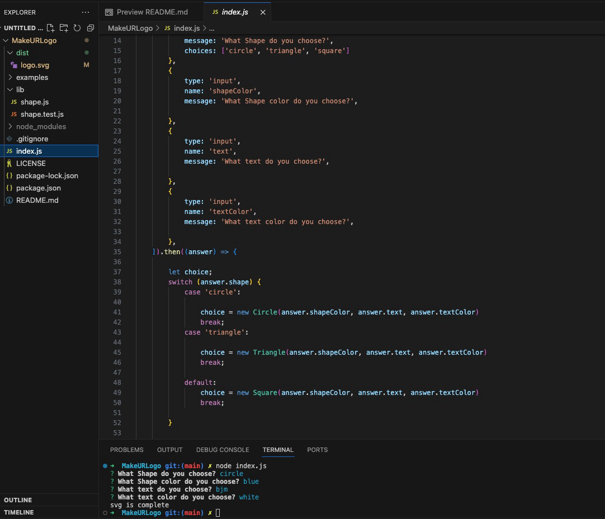

# 10 Object-oriented Programming: SVG Logo Maker
# MakeURLogo
  
## Description
  
This nodejs app utlizes inquirer, to prompt the end user with a list of questions, to create an svg file. 
Object oriented programming, was utilized to handle all of the reiterated code, for the different shapes.  
Jest was also utilized, to run tests on the different shapes, ensuring we are returning the expected data.

## Installation

npm i inquirer@8.2.4

## Usage

To begin and run this app, you type node index.js into the command line.

 ## Questions

Link to my github profile: [BrianJohnMaher](https://github.com/BrianJohnMaher)

A link to the project: [SVG Generator](https://github.com/BrianJohnMaher/MakeURLogo)
  
Further questions may email me at: [BMaher22@mac.com](BMaher22@mac.com)

A link to the youtube demo video: [MakeURLogo - SVG Generator Walkthrough Video](https://youtu.be/BxfNU7UaCms)